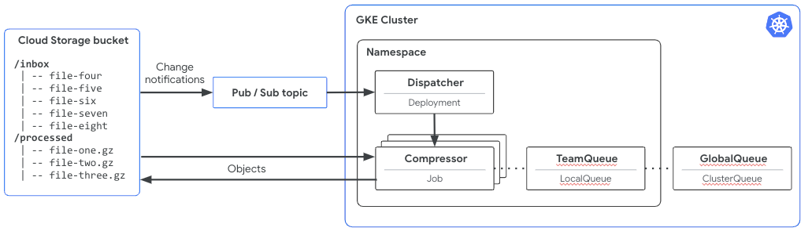

# Kueue hands-on

This repository contains tutorials and guides of running [Kueue](https://kueue.sh) based
High Performance Computing / Batch infrastructure on [Google Kubernetes Engine](https://cloud.google.com/kubernetes-engine).

## Target audience

The guides and tutorials are targeted for someone planning to run batch workloads on Kubernetes clusters
and wants to learn how it can be done with [Kueue](https://kueue.sh) and [Google Kubernetes Engine](https://cloud.google.com/kubernetes-engine).

## Labs

* [Prerequisites](./docs/01-prerequisites.md)
* [Cluster setup](./docs/02-cluster-setup.md)

## Lab scenario

Some of the labs are based on the following scenario: the batch `compressor` jobs are created by the
`dispatcher` application. This happens based on the events from Cloud Storage bucket.
Next, the `compressor` job compresses objects from `inbox` directory and stores compressed results in
the `processed` directory.

The [terraform](./terraform/) directory contains the code for setting up the required infrastructure.

The [dispatcher](./dispatcher/) directory contains the code of the `dispatcher` application.

The [compressor](./dispatcher/) directory contains the code of the `compressor` application.
